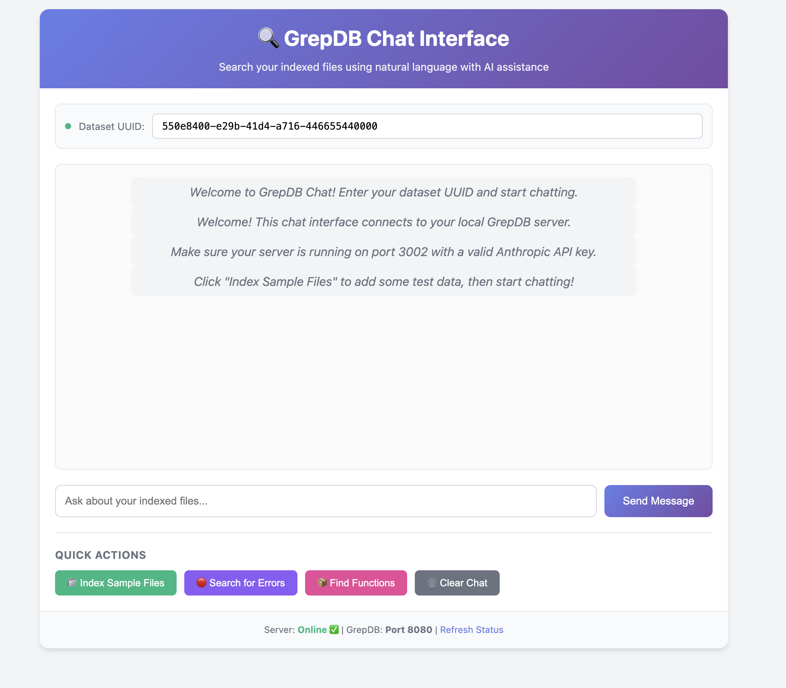

# GrepDB Chat Demo



Quick setup guide for the GrepDB AI chat interface.

## Prerequisites
- Docker & Docker Compose
- Bun runtime
- Anthropic API key

## Setup

1. **Start GrepDB**
```bash
docker compose up -d
```

2. **Configure API**

```bash
cd example
cp .env.dist .env
```

You will need to edit this with your `ANTHROPIC_API_KEY`

3. **Install & Run Server**
```bash
bun install
bun run server.ts
# or for dev mode with auto-reload:
bun dev
```

4. **View Frontend**

The frontend is just a quick `index.html` file. To view it with hot loading run

```bash
reload -b -p 3030 # npm i -g reload
```

## Endpoints
- GrepDB: http://localhost:8080
- Chat Server: http://localhost:3002
- Frontend: http://localhost:3030 (via reload)

## Usage
1. Enter a dataset UUID (e.g., `550e8400-e29b-41d4-a716-446655440000`)
2. Index files using the "Index Sample Files" button
3. Chat with the AI to search your indexed files
